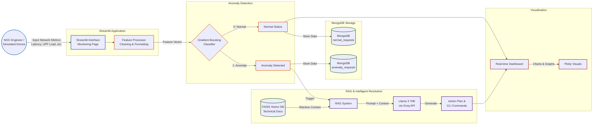

🛡️ 5G NOC Anomaly Detection System
This project presents a robust 5G Network Operations Center (NOC) Anomaly Detection System, a Streamlit-based application designed to monitor 5G network requests in real-time, identify anomalies, and provide actionable intelligence to NOC engineers. It integrates a machine learning model for anomaly detection with an advanced Retrieval-Augmented Generation (RAG) system powered by Google's Gemini Pro model via the Groq API for generating comprehensive solutions.

✨ Features
Real-time Network Monitoring: Input network request data and get instant anomaly detection results.
Machine Learning-Powered Anomaly Detection: Utilizes a pre-trained model (model.joblib) to classify network requests as normal or anomalous based on critical 5G performance and security metrics.

Intelligent NOC Engineer Solutions (Powered by Llama 3 70B via Groq): When an anomaly is detected, the system generates detailed action plans, including:
Immediate Actions
Short-term Resolutions
Root Cause Analysis
Prevention Strategies
Escalation Criteria
Monitoring Recommendations These solutions are contextually rich, pulling from relevant documentation (if FAISS index is available) and leveraging the reasoning capabilities of the Llama 3 70B language model.

Quick Fix CLI Commands: Provides immediate, actionable command-line interface (CLI) suggestions for rapid incident response.

Request Analysis Dashboard: View recent normal and anomalous requests, with the ability to dive into details and regenerate Llama-powered solutions for past anomalies.

System Dashboard: Get an overview of system performance, including total requests, anomaly rates, and critical feature statistics.

Historical Data Analysis: Visualize trends of critical features over time, analyze feature correlations, and understand anomaly patterns by device type and network slice.

Data Export: Export all historical data, anomalies only, or feature statistics in CSV format for further analysis.
Customizable Styling: Modern and intuitive user interface with custom CSS for improved readability and user experience.

MongoDB Integration: Persistently stores all network request data (normal and anomalous) for historical analysis and review.



🚀 Getting Started
Follow these steps to set up and run the 5G NOC Anomaly Detection System locally.

Prerequisites
Python 3.9+
MongoDB Atlas account (or a local MongoDB instance)
Groq API Key
Installation

Clone the repository:

Bash

git clone https://github.com/your-username/5g-noc-anomaly-detection.git
cd 5g-noc-anomaly-detection
 ```

Create a virtual environment (recommended):

Bash

python -m venv venv
source venv/bin/activate  # On Windows: `venv\Scripts\activate`
Install the required Python packages:

Bash

pip install -r requirements.txt
(A requirements.txt file is not provided in the prompt, so you'll need to create one with the following packages: streamlit, pandas, numpy, joblib, pymongo, python-dotenv, groq, plotly, faiss-cpu, scikit-learn (assuming for joblib model) scipy.)

Configuration
Environment Variables:
Create a .env file in the root directory of the project and add the following:

MONGODB_URI="YOUR_MONGODB_CONNECTION_STRING"
GROQ_API_KEY="YOUR_GROQ_API_KEY"
Replace "YOUR_MONGODB_CONNECTION_STRING" with your MongoDB Atlas connection string (e.g., mongodb+srv://<username>:<password>@<cluster-url>/<dbname>?retryWrites=true&w=majority).
Replace "YOUR_GROQ_API_KEY" with your actual Groq API key, obtained from the Groq website.
Model and FAISS Index:

Place your pre-trained machine learning model file named model.joblib in the project's root directory.
Ensure your FAISS index files (index.faiss and index.pkl) are located in the guide_for_5g_vector_db/ directory. If you don't have these, the RAG system will still function using general knowledge from the Llama model, but document retrieval will be disabled.
Running the Application
Start the Streamlit application:

Bash

streamlit run app.py
The application will open in your web browser, typically at http://localhost:8501.

📂 Project Structure
5g-noc-anomaly-detection/
├── app.py                      # Main Streamlit application script
├── .env                        # Environment variables (MongoDB URI, Groq API Key)
├── model.joblib                # Pre-trained anomaly detection model
├── requirements.txt            # Python dependencies
├── guide_for_5g_vector_db/
│   ├── index.faiss             # FAISS vector index for RAG
│   └── index.pkl               # Pickle file containing documents for RAG
└── README.md                   # This README file

🛠️ Technologies Used
Streamlit: For creating the interactive web application.
Python: The core programming language.
scikit-learn: For the machine learning anomaly detection model (assuming joblib is used for a scikit-learn model).
Pandas & NumPy: For data manipulation and numerical operations.
Plotly Express & Plotly Graph Objects: For interactive data visualizations.
PyMongo: Python driver for MongoDB.
MongoDB: NoSQL database for storing network request data.
Groq: High-speed inference engine for large language models.
Llama 3 70B: The large language model used for generating NOC engineer solutions.
FAISS: For efficient similarity search in the RAG system.
python-dotenv: For managing environment variables.

🤝 Contributing
Contributions are welcome! If you have suggestions for improvements or new features, please open an issue or submit a pull request.

📄 License
This project is open-source and available under the MIT License.

